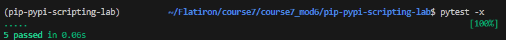

# Python Automation Tool

## Overview

This project demonstrates how to build a Python automation script using packages installed from PyPI with `pip`. The application retrieves external data from an API and writes the retrieved information to a timestamped log file.

The project demonstrates Python scripting, File I/O, dependency management, API requests, and reusable script structure.

## Learning Objectives

This project demonstrates how to:

- Install and manage external Python packages using `pip`
- Use the `requests` package to retrieve data from an external API
- Process JSON data returned from an API
- Generate timestamped output files
- Write data to files using Python File I/O
- Validate function input
- Structure reusable Python scripts using `if __name__ == "__main__"`
- Track project dependencies using `requirements.txt`

## Project Structure

```text
pip-pypi-scripting-lab/
├── lib/
│   ├── __init__.py
│   └── generate_log.py
├── testing/
├── .gitignore
├── Pipfile
├── Pipfile.lock
├── pytest.ini
├── requirements.txt
└── README.md
```

## Installation

Clone the repository and navigate into the project directory:

```bash
git clone <repository-url>
cd pip-pypi-scripting-lab
```

Install the required dependencies:

```bash
pip install -r requirements.txt
```

The primary external package used by this project is `requests`.

## Running the Application

Navigate to the `lib` directory:

```bash
cd lib
```

Run the application:

```bash
python generate_log.py
```

When executed, the application:

1. Sends a GET request to the JSONPlaceholder API.
2. Converts the successful JSON response into Python data.
3. Retrieves the title from the returned post.
4. Passes the title to `generate_log()`.
5. Creates a timestamped text file.
6. Writes the retrieved title to the log file.
7. Prints confirmation messages to the terminal.

An example generated filename is:

```text
log_20260814.txt
```

## Functions

### `generate_log(data)`

The `generate_log()` function accepts a list of log entries and writes each entry to a timestamped text file.

The function:

- Validates that the supplied data is a list
- Raises a `ValueError` if the supplied data is not a list
- Generates a filename using the current date
- Writes each entry on a separate line
- Prints a confirmation message
- Returns the generated filename

### `fetch_data()`

The `fetch_data()` function retrieves a sample post from the JSONPlaceholder API using the `requests` package.

If the HTTP request succeeds with a `200` status code, the function returns the JSON response as a Python dictionary. Otherwise, it returns an empty dictionary.

## Dependencies

Project dependencies are recorded in `requirements.txt`.

The dependency file can be regenerated using:

```bash
pip freeze > requirements.txt
```

This allows another developer to recreate the Python environment and install the packages required by the application.

## Testing

The project includes automated tests using `pytest`.

From the project root, run:

```bash
pytest -x
```

The `-x` option stops pytest after the first failing test, making individual failures easier to diagnose.

The test suite verifies the expected behavior of the log generator, including file creation, returned filenames, and input validation.

## Generated Files

Generated log files use the following naming convention:

```text
log_YYYYMMDD.txt
```

Because these files are generated when the application runs, they are excluded from version control using `.gitignore`:

```gitignore
log_*.txt
```

## Screenshot



## Conclusion

This project demonstrates a complete Python automation workflow using:

- Python scripting
- PyPI packages and `pip`
- API integration with `requests`
- JSON data processing
- File I/O
- Timestamped output files
- Input validation
- Dependency tracking
- Command-line execution
- Automated testing with `pytest`

The application retrieves external data, processes the API response, and automatically writes the resulting information to a timestamped log file.

## Author

Created by Matthew Swanberg as part of  Course 7 Module6 (Automating Python Projects with Pip, PyPi & Scripting)